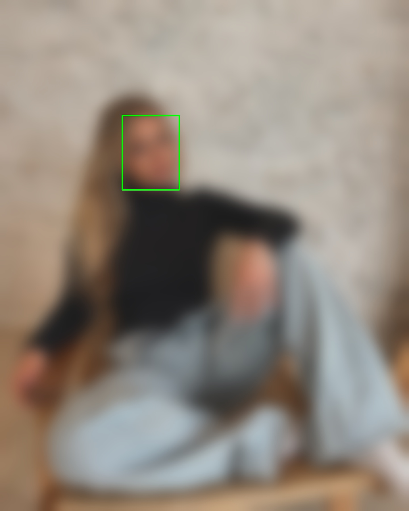
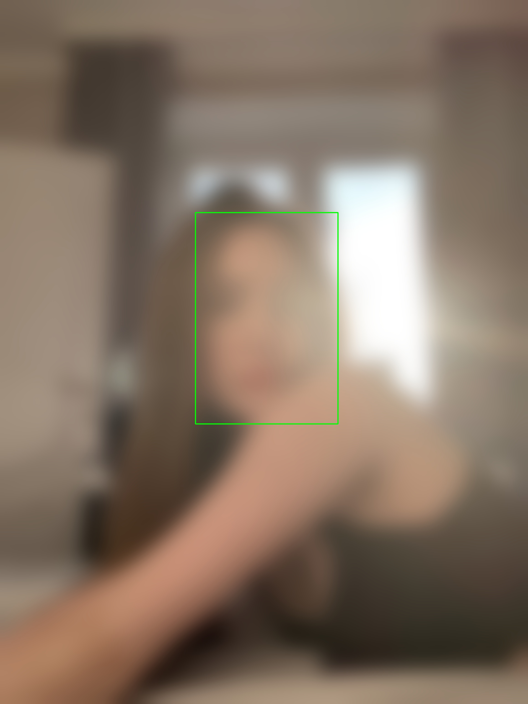
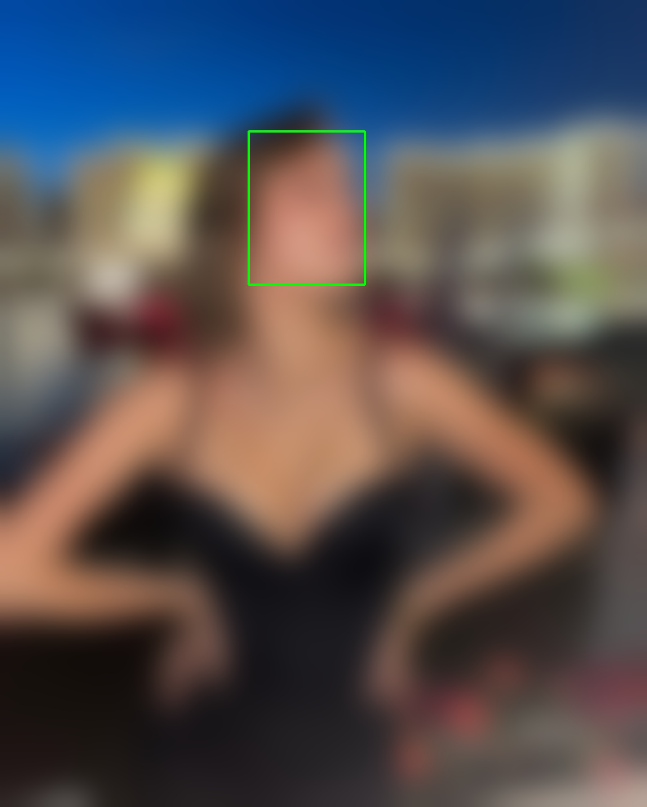
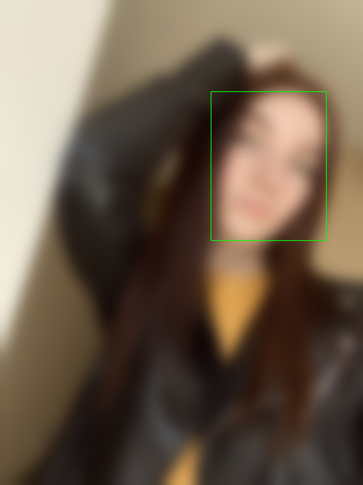

# tinder_profiles

## Overview
This repository contains code for the analysis of anonymized Tinder user profile data. The dataset primarily focuses on profiles from the Groningen region, but it may include profiles from various regions as well.

## Contents
Dataset contains features (after processing):
*  `age`
*  `is_selfie_verified`
*  `gender`
*  `schools`
*  `city`
*  `show_gender_on_profile`
*  `relationship_intent`
*  `sexual_orientations`
*  `hide_age`
*  `hide_distance`
*  `is_traveling`
*  `custom_gender`
*  `zodiac_sign`
*  `height`
*  `education_level`
*  `relationship_type`
*  `workout`
*  `professions`
*  `company_name`
*  `has_face`

## Faces

Exploring the tinder API it was found that json profiles contains a field - "crop_info" where the box faces are specified with high precision in the form:

```json
   "crop_info": {
			"user": {
				"width_pct": 1,
				"x_offset_pct": 0,
				"height_pct": 0.8,
				"y_offset_pct": 0
			},
			"algo": {
				"width_pct": 0.34605344,
				"x_offset_pct": 0.44997345,
				"height_pct": 0.31724511,
				"y_offset_pct": 0.036002084
			},
			"processed_by_bullseye": true,
			"user_customized": false,
			"faces": [
				{
					"algo": {
						"width_pct": 0.34605344,
				"x_offset_pct": 0.44997345,
				"height_pct": 0.31724511,
				"y_offset_pct": 0.036002084
					},
					"bounding_box_percentage": 11
				}
			]
		},
```


<p align="center">
  
  
  
  
  
</p>

## Getting Started
To get started with the code and data, follow these steps:

1. Clone this repository to your local machine.
2. Navigate to the relevant directories for data, analysis, or scripts.
3. Run the provided scripts or notebooks to perform the desired analysis.

## Data Privacy and Ethics
Please note that the data used in this repository is anonymized to protect user privacy and comply with ethical standards. If you plan to use this code or data for research or any other purpose, make sure to adhere to relevant data protection and privacy regulations.

## Contribution
Contributions to this project are welcome! If you have ideas for improvements, new analyses, or additional data sources, please feel free to create pull requests.
